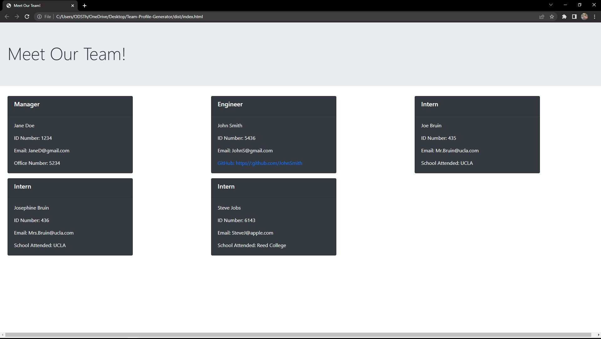

# Team-Profile-Generator

## Description
#### This is a generator made using Node.js, jest, and inquirer, it lets you make a professional team profile webpage quick and easy. It does this by taking in information input by users and generates an HTML webpage that displays summaries for each person based on information gathered.

## Usage
#### To use it, go into the intergrated terminal then type node index It will then prompt you questions and after they are all answered your Team webpage is generated! File is located in the dist folder after generated, open in default browser to see your new team profile.

## Contribution
#### Justyn Subrai

 ## Video Demonstration Link 
 #### <a href= 'https://drive.google.com/file/d/1E_GJEzQ6vjmeZiZgr4jtVwlIcZ7yh3eb/view'>Click for Video</a>

 ## Github Repo 
 #### <a href= 'https://github.com/JustynSubrai/Team-Profile-Generator'>Github</a>

 ## Generated Website
 ##
 ### 